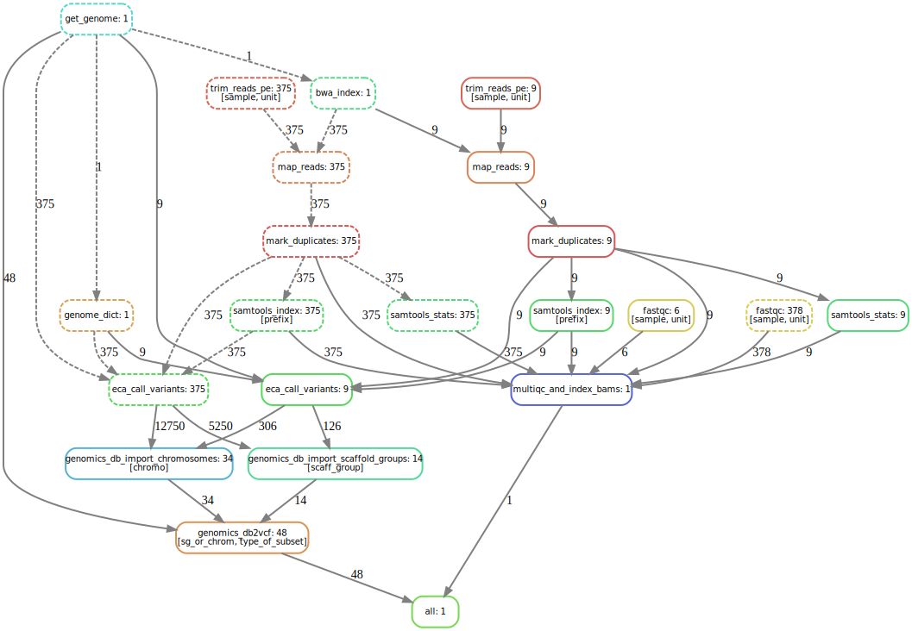

SnakemakeDagR
================
Eric C. Anderson

This is an R package in development. My main goal here is to be able to
render DAG output from Snakemake that is somewhat shaped like the
rulegraph, but also contains some more information than it.

My main beef with the straight-up DAG is that if you have a lot of
instances of each job, it is total nightmare to visualize. The rulegraph
on the other hand, doesn’t give you any information about how many
instances have successfully run and how many have not.

## Example DAGs

As an example I am using DAGs from a bioinformatics project I am
involved in at the moment, crunching through WGS data from Yukon River
Chinook salmon. There are 384 samples, but the fastqs for 9 of them were
corrupt. So, there are a few jobs left to do when we get uncorrupted
versions of those (if we ever do).

This is the DAG for all the jobs up through trimming, mapping,
dup-marking, and QC-ing.

Here is the DAG, obtained with:

``` sh
snakemake -np --dag results/qc/multiqc.html > ~/example_dag.dot
```

This is available with

``` r
system.file("extdata/example_dag.dot", package = "SnakemakeDagR")
```

## Functions

The main function is `condense_dag()` which turns the dag output into
something that looks like the rulegraph, but has dashed and solid rules
to indicate whether they have been completed or not, and also includes
the number of instances of each rule that are completed (for dashed
nodes) and the number of instances that remain to be run (for solid
nodes). The edges are also labelled with the number of instances that
have been done or which remain to be done. Also we print the names of
the wildcards on the nodes. Note that the wildcard names only come out
on the “top” node of a chain that uses the same wildcards.

``` r
library(SnakemakeDagR)
condense_dag(
  dagfile = system.file("extdata/example_dag.dot", package = "SnakemakeDagR"), 
  outfile = "condensed.dot" 
)
```

Running dot on the resulting output file gives this sort of picture:


Cool!

## A more complex example

Here is what things look like on the workflow when it is expanded out to
some variant calling, making this dotfile:

``` r
system.file("extdata/more_steps.dot", package = "SnakemakeDagR")
```

which condenses down to this:


That is pretty informative. I like being able to see the different
wildcards that are in play.

## Running it on the command line

If you have R up and running on your system, and you have installed the
`SnakemakeDagR` package, then you can make a small executable file named
`condense_dag` that looks like this:

``` r
#!/usr/local/bin/Rscript
SnakemakeDagR::condense_dag(
  dagfile = file("stdin"),
  outfile = stdout() 
)
```

and put it in your `PATH`.

Note that the top line (with the shebang: `#!`) has to point to Rscript
on your system. You can get that with `which Rscript`.

Then when you make a DAG with Snakemake, you can just pipe it through to
condense it and render it with dot like this:

``` sh
snakemake  --dag | condense_dag | dot -Tpng > condensed_dag.png
```

Sweet!
